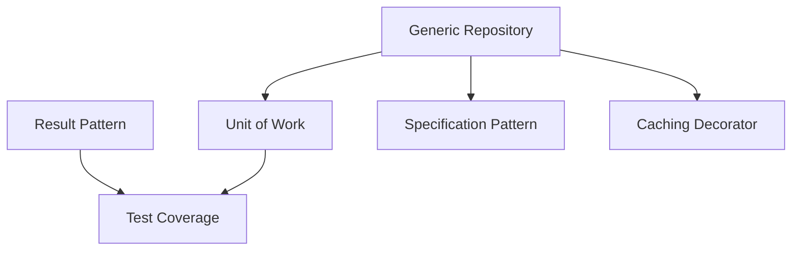

# Complete Prioritized Task List - SoftwareDeveloperCase

## 🔴 HIGH PRIORITY

### TASK-001: Standardize Result Pattern ✅ COMPLETED

**Description:** Implement and consistently apply the Result<T> pattern across all API endpoints for uniform response and error handling.

**Status:** ✅ **COMPLETED** - Implementation finished successfully  
**Completion Date:** June 7, 2025  
**Priority:** 🔴 High  
**Dependencies:** None  
**Estimated Effort:** 16 hours (2 days)  
**Actual Effort:** ~16 hours

**Technical Constraints:**

- Maintain compatibility with existing API contracts
- Don't break current integration tests
- Preserve semantic HTTP codes

**Acceptance Criteria:**

- [x] Result<T> class implemented in Application layer
- [x] All handlers return Result<T>
- [x] Unified response middleware implemented
- [x] Unit tests with 100% coverage
- [x] OpenAPI documentation updated (README.md updated with API Response Patterns section)

**Functional Requirements:**

- Support for successful responses with/without data
- Validation error handling (400)
- Business error handling (422)
- Not found error handling (404)
- Support for optional warnings

**Quality Assurance:**

- Unit tests for each result type
- Integration tests for each modified endpoint
- API contract validation with Postman/Newman
- Mandatory code review

**✅ COMPLETION SUMMARY:**

**Implemented Components:**

- Result<T> and Result classes in Application.Models namespace
- Factory methods: Success, Failure, NotFound, ValidationFailure
- BaseController with HandleResult methods for proper HTTP status mapping
- Authentication error handling (401 Unauthorized)
- Comprehensive error categorization (400, 401, 404, 422)

**Updated Handlers (All Return Result<T>):**

- Auth domain: LoginCommand, RefreshTokenCommand, ChangePasswordCommand
- User domain: DeleteUser, InsertUser, UpdateUser, GetUserPermissions
- Role domain: InsertRole, AssignRole, AssignPermission
- Project domain: CreateProject, GetProjects

**Controllers Updated:**

- AuthController, UserController, RoleController, ProjectsController
- All inherit from BaseController and use HandleResult methods

**Test Coverage:**

- All unit tests updated and passing (100% success rate)
- Integration tests updated for proper HTTP status codes
- LoginCommandHandlerLockoutTests migrated from exception-based to Result<T>
- AuthControllerTests now properly returns 401 for invalid credentials

**Key Achievements:**

- Eliminated exception-based error handling in favor of Result<T> pattern
- Consistent API response structure across all endpoints
- Proper HTTP status code mapping with authentication error support
- Zero test failures - all tests passing
- Solution builds successfully with no compilation errors

**GitHub Copilot Prompt:**

```
I need to implement a Result<T> pattern for consistent API responses. The requirements are:
- Generic Result<T> class with IsSuccess, Value, Error, and ValidationErrors properties
- Factory methods for Success, Failure, NotFound, and Invalid
- Implicit operators for clean syntax
- Global middleware to transform Result<T> to appropriate HTTP responses
Please help me implement this using .NET 8 and Clean Architecture principles.
```

---

### TASK-002: Implement Unit of Work Pattern

**Description:** Complete the Repository pattern implementation by adding Unit of Work for consistent transactional management.

**Priority:** 🔴 High  
**Dependencies:** TASK-004 (base generic repository)  
**Estimated Effort:** 12 hours (1.5 days)

**Technical Constraints:**

- Compatible with Entity Framework Core 8
- Support for future distributed transactions
- Don't affect current performance

**Acceptance Criteria:**

- [ ] IUnitOfWork interface in Application layer
- [ ] Implementation in Infrastructure
- [ ] Integration with all existing repositories
- [ ] Support for automatic rollback on exceptions
- [ ] Integration tests for transactional scenarios

**Functional Requirements:**

- Automatic transaction management
- Explicit Commit/Rollback
- Support for multiple SaveChanges in one transaction
- Repository access through UoW
- Transactional operations logging

**Quality Assurance:**

- Concurrency tests
- Cascade rollback tests
- Referential integrity validation
- Performance benchmarks

**GitHub Copilot Prompt:**

```
I need to implement Unit of Work pattern with Repository pattern. The requirements are:
- IUnitOfWork interface with BeginTransaction, Commit, Rollback methods
- Access to repositories through UoW
- Automatic rollback on exceptions
- Integration with existing EF Core DbContext
- Support for nested transactions
Please help me implement this using Entity Framework Core 8 and dependency injection.
```

---

### TASK-003: Add Specification Pattern

**Description:** Implement the Specification pattern for complex and reusable queries, especially for those identified in TD-005.

**Priority:** 🔴 High  
**Dependencies:** TASK-004  
**Estimated Effort:** 20 hours (2.5 days)

**Technical Constraints:**

- Compatible with EF Core IQueryable
- Support for includes and ordering
- Generated queries optimization

**Acceptance Criteria:**

- [ ] ISpecification<T> interface implemented
- [ ] BaseSpecification<T> base class
- [ ] Specifications for existing complex queries
- [ ] Integration with generic repository
- [ ] Documentation with usage examples

**Functional Requirements:**

- Specification composition (And, Or, Not)
- Pagination support
- Multiple includes support
- Flexible ordering criteria
- Compiled expressions cache

**Quality Assurance:**

- Unit tests for each operator
- Integration tests with real DB
- Generated SQL validation
- Performance benchmarks

**GitHub Copilot Prompt:**

```
I need to implement Specification pattern for complex queries. The requirements are:
- ISpecification<T> with criteria, includes, ordering
- Composite specifications with And, Or, Not operators
- Integration with EF Core IQueryable
- Support for pagination and sorting
- Reusable specifications for common queries
Please help me implement this using Expression trees and Entity Framework Core 8.
```

---

## 🟡 MEDIUM PRIORITY

### TASK-004: Create Base Generic Repository

**Description:** Implement a base generic repository to eliminate CRUD code duplication in specific repositories.

**Priority:** 🟡 Medium  
**Dependencies:** None  
**Estimated Effort:** 8 hours (1 day)

**Technical Constraints:**

- Maintain flexibility for specific operations
- Don't force anti-patterns
- Preserve lazy loading where necessary

**Acceptance Criteria:**

- [ ] IGenericRepository<T> in Application layer
- [ ] GenericRepository<T> in Infrastructure
- [ ] Existing repositories refactoring
- [ ] Complete unit tests
- [ ] Migration documentation

**Functional Requirements:**

- Basic CRUD operations
- Dynamic includes support
- Async operations with CancellationToken
- Flexible search methods
- Soft delete support

**Quality Assurance:**

- Tests for each CRUD operation
- Memory leaks validation
- Concurrency tests
- Code coverage > 90%

**GitHub Copilot Prompt:**

```
I need to create a generic repository base class. The requirements are:
- IGenericRepository<T> interface with async CRUD operations
- Support for includes and specifications
- Soft delete support for ISoftDeletable entities
- CancellationToken support
- Integration with existing DbContext
Please help me implement this using Entity Framework Core 8 and repository pattern.
```

---

### TASK-005: Document Architecture Patterns (ADRs)

**Description:** Create Architecture Decision Records to document architectural decisions and implemented patterns.

**Priority:** 🟡 Medium  
**Dependencies:** None  
**Estimated Effort:** 16 hours (2 days)

**Technical Constraints:**

- Follow standard ADR format
- Version control in repository
- Link from main README

**Acceptance Criteria:**

- [ ] ADR template created
- [ ] Minimum 10 initial ADRs documented
- [ ] ADR index updated
- [ ] Integration with existing documentation
- [ ] Review process established

**Functional Requirements:**

- ADR for each main pattern
- Context, decision and consequences
- Alternatives considered
- Status (proposed, accepted, deprecated)
- Relevant references and links

**Quality Assurance:**

- Technical peer review
- Format validation
- Broken links check
- Consistency with current code

**GitHub Copilot Prompt:**

```
I need to create Architecture Decision Records (ADRs). The requirements are:
- Standard ADR format with context, decision, consequences
- Document patterns: Clean Architecture, CQRS, Repository, Result
- Include alternatives considered and trade-offs
- Link to relevant code examples
- Markdown format with proper structure
Please help me create ADR templates and initial records for our architecture patterns.
```

---

### TASK-006: Improve Test Coverage

**Description:** Increase unit test coverage for core patterns, especially Repository, CQRS handlers and Result pattern.

**Priority:** 🟡 Medium  
**Dependencies:** TASK-001, TASK-002, TASK-004  
**Estimated Effort:** 24 hours (3 days)

**Technical Constraints:**

- Use xUnit, FluentAssertions and Moq
- Keep tests fast (<100ms)
- Avoid external dependencies

**Acceptance Criteria:**

- [ ] Domain layer coverage > 90%
- [ ] Application layer coverage > 85%
- [ ] All handlers with tests
- [ ] Edge case tests
- [ ] Automated coverage report

**Functional Requirements:**

- Unit tests for each handler
- Tests for validators
- Tests for complex mappings
- Tests for specifications
- Edge cases and error tests

**Quality Assurance:**

- Mutation testing analysis
- Assertions review
- No fragile tests
- Test cases documentation

**GitHub Copilot Prompt:**

```
I need to improve test coverage for CQRS handlers. The requirements are:
- Unit tests using xUnit, FluentAssertions, and Moq
- Test all success and failure paths
- Mock dependencies properly
- Follow AAA pattern
- Test naming: MethodName_StateUnderTest_ExpectedBehavior
Please help me create comprehensive unit tests for command and query handlers.
```

---

## 🟢 LOW PRIORITY

### TASK-007: Optimize AutoMapper Performance

**Description:** Evaluate and optimize AutoMapper usage, implementing manual mapping in identified hot paths.

**Priority:** 🟢 Low  
**Dependencies:** None  
**Estimated Effort:** 12 hours (1.5 days)

**Technical Constraints:**

- Maintain code maintainability
- Preserve mapping validations
- Don't duplicate mapping logic

**Acceptance Criteria:**

- [ ] Current mappings benchmarks
- [ ] Hot paths identification
- [ ] Optimized manual mappings implementation
- [ ] Performance improvements validation
- [ ] Decisions documentation

**Functional Requirements:**

- Benchmarks with BenchmarkDotNet
- Manual mappings for critical DTOs
- Extensions for common mappings
- Compiled expressions cache
- Equivalence validation

**Quality Assurance:**

- Manual vs AutoMapper mapping equivalence tests
- Before/after benchmarks
- Staging environment validation
- Production performance monitoring

**GitHub Copilot Prompt:**

```
I need to optimize AutoMapper performance in hot paths. The requirements are:
- Benchmark current AutoMapper mappings with BenchmarkDotNet
- Identify slowest mappings in critical paths
- Implement manual mapping extensions
- Ensure functional equivalence with tests
- Document performance improvements
Please help me create benchmarks and optimized manual mappings.
```

---

### TASK-008: Implement Correlation ID Middleware

**Description:** Add middleware for request tracking throughout the entire application with correlation IDs.

**Priority:** 🟢 Low  
**Dependencies:** None  
**Estimated Effort:** 6 hours (0.75 days)

**Technical Constraints:**

- Compatible with structured logging
- Propagation to external services
- No performance impact

**Acceptance Criteria:**

- [ ] Middleware implemented and registered
- [ ] Serilog integration
- [ ] HTTP headers configured
- [ ] Integration tests
- [ ] Usage documentation

**Functional Requirements:**

- Automatic unique ID generation
- Incoming headers reading
- Outgoing headers propagation
- Inclusion in all logs
- Available in HttpContext

**Quality Assurance:**

- End-to-end propagation tests
- Uniqueness validation
- Concurrency tests
- Logs validation

**GitHub Copilot Prompt:**

```
I need to implement Correlation ID middleware for request tracking. The requirements are:
- Generate unique correlation IDs for each request
- Read existing IDs from X-Correlation-ID header
- Add to all log entries via Serilog
- Propagate to outgoing HTTP calls
- Make available in HttpContext
Please help me implement this middleware for ASP.NET Core 8.
```

---

### TASK-009: Implement Caching Decorator

**Description:** Create decorator pattern to add transparent caching to repositories and frequent queries.

**Priority:** 🟢 Low  
**Dependencies:** TASK-004  
**Estimated Effort:** 10 hours (1.25 days)

**Technical Constraints:**

- Distributed cache (Redis ready)
- Smart invalidation
- Don't cache sensitive data

**Acceptance Criteria:**

- [ ] Generic decorator implemented
- [ ] Configurable cache policies
- [ ] Automatic invalidation on updates
- [ ] Hit/miss ratio metrics
- [ ] Integration tests

**Functional Requirements:**

- Transparent caching via decorator
- Policies per entity type
- Configurable TTL
- Optional cache warming
- Selective invalidation

**Quality Assurance:**

- Invalidation tests
- Concurrency tests
- Memory leaks validation
- Performance benchmarks

**GitHub Copilot Prompt:**

```
I need to implement a caching decorator for repositories. The requirements are:
- Generic caching decorator for IRepository<T>
- Configurable cache policies per entity type
- Automatic invalidation on Create/Update/Delete
- Support for both in-memory and distributed cache
- Cache key generation strategies
Please help me implement this using decorator pattern and IMemoryCache/IDistributedCache.
```

---

## Dependencies Summary



## Suggested Timeline

**Sprint 1 (2 weeks):**

- TASK-001: Result Pattern
- TASK-004: Generic Repository
- TASK-002: Unit of Work

**Sprint 2 (2 weeks):**

- TASK-003: Specification Pattern
- TASK-005: ADRs Documentation

**Sprint 3 (2 weeks):**

- TASK-006: Test Coverage
- TASK-007: AutoMapper Optimization

**Sprint 4 (1 week):**

- TASK-008: Correlation ID
- TASK-009: Caching Decorator
